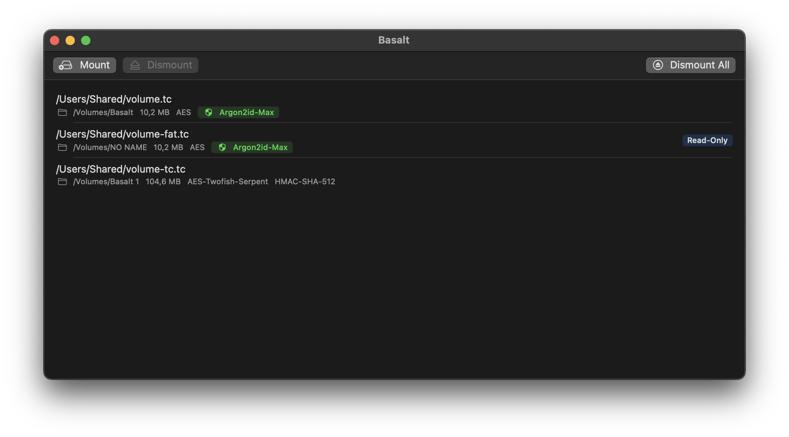
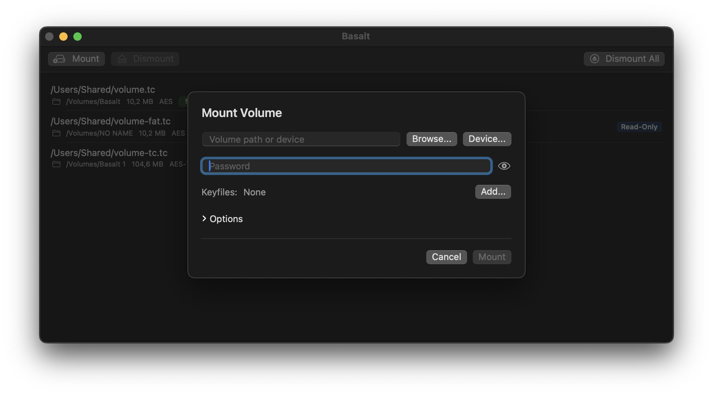
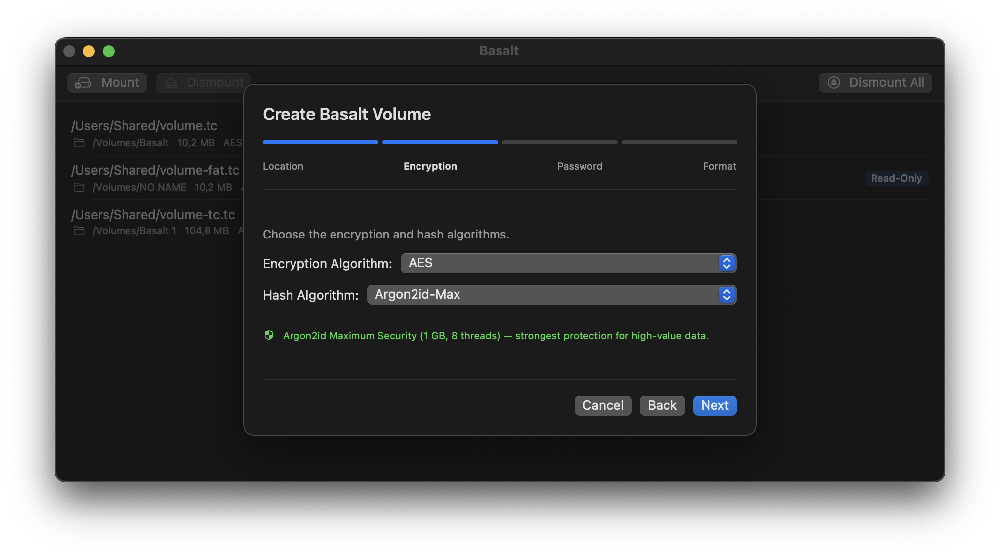
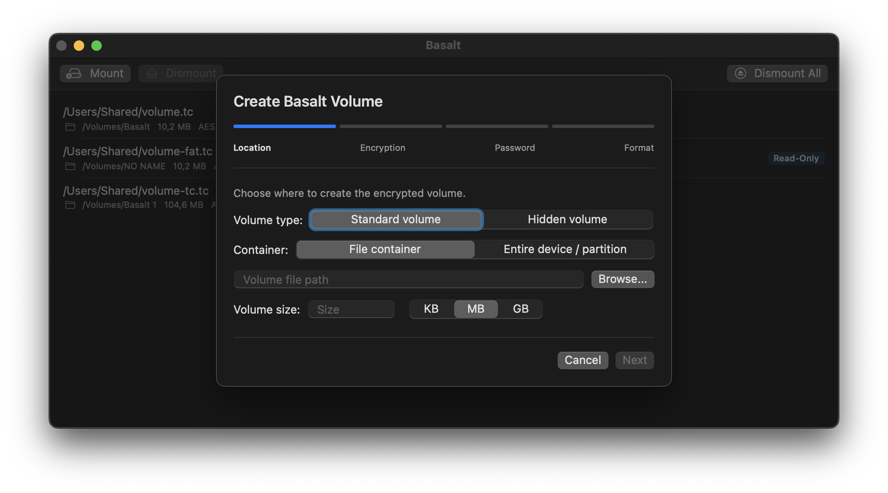
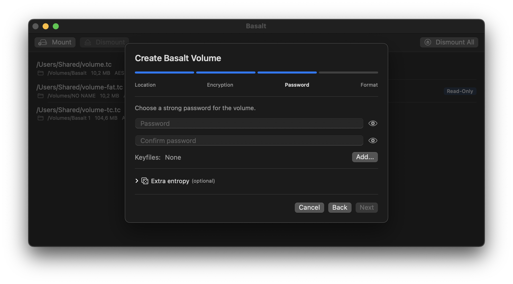
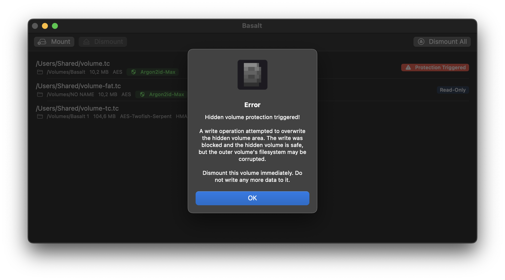

<p align="center">
  
</p>
<h1 align="center">Basalt</h1>
<p align="center">
  <strong>A security-hardened fork of TrueCrypt 7.1a for macOS, Linux, and Windows</strong><br>
  Native SwiftUI app &middot; Argon2id key derivation &middot; DarwinFUSE (no kext) &middot; Universal Binary (arm64 + x86_64)
</p>
<p align="center">
  
  
  
  
</p>

---

TrueCrypt was abandoned in 2014. VeraCrypt continued it, but added questionable
ciphers, a complex PIM system, and a Windows bootloader signed by Microsoft.

Basalt takes a different path: fix what's broken, remove what shouldn't be there,
and build a native macOS app from scratch. No wxWidgets, no password cache, no
window dressing — just solid encryption with modern key derivation.

<p align="center">
  
</p>

<p align="center">
  
  
</p>


## Key Features

- **Argon2id key derivation** — 1 GB memory cost, 8 threads. GPU-resistant by design.
- **Opens TrueCrypt & VeraCrypt volumes** — plus automatic KDF upgrade prompt for legacy iterations.
- **Hidden volumes** — create and mount with plausible deniability, with write protection for the outer volume.
- **Native SwiftUI app** — no wxWidgets, no Qt on macOS. Clean, dark-mode interface.
- **Cross-platform CLI** — `basalt-cli` on macOS, Linux, and Windows.
- **DarwinFUSE built-in** — no macFUSE, no kernel extension, no SIP changes.
- **Zero-state design** — no password cache, no favorites, no history. Forensic analysis reveals nothing.
- **Auto-dismount** — on inactivity, screen lock, sleep, quit, and logout.
- **Screen capture protection** — the entire app is invisible to screenshots, screen recording, and AirPlay.
- **~60,000 lines of attack surface removed** — boot loader, kernel driver, PKCS#11, wxWidgets all deleted.

<details>
<summary><strong>More screenshots</strong></summary>
<br>
<p align="center">
  
  
  
  
</p>
</details>


## Volume Compatibility

| Format | Mount | Create |
|--------|:-----:|:------:|
| Basalt | ✓ | ✓ |
| TrueCrypt 7.1a | ✓ | ✓ (legacy mode) |
| VeraCrypt | ✓ | — |

Existing volumes just work. Legacy TrueCrypt volumes get an automatic upgrade
prompt for modern key derivation.


## Building

### macOS

Requirements: macOS 12+, Xcode Command Line Tools, pkg-config.
No external FUSE installation required.

```sh
bash build-universal.sh release
```

### Linux

```sh
sudo apt install build-essential pkg-config libfuse-dev   # Debian/Ubuntu
make NOASM=1 cli
sudo ./CLI/basalt-cli --mount /path/to/volume
```

### Windows

```powershell
cmake -B build_windows -G "Visual Studio 17 2022" -A x64
cmake --build build_windows --config Release
basalt-cli.exe volume.tc F:
```

On Windows, Basalt uses a local iSCSI target — no FUSE, no kernel driver.
The built-in iSCSI Initiator creates a real block device per drive letter.


## Architecture

```
Basalt.app (SwiftUI)          Native macOS UI (macOS 12+)
  TCCoreBridge.mm (ObjC++)    Bridge: Foundation ↔ C++
basalt-cli (C++)              Standalone terminal tool (macOS + Linux + Windows)
  libBasaltCore.a (src/)      Crypto + Volume + FUSE + Platform
```


## Documentation

| Document | Contents |
|----------|----------|
| **[SECURITY.md](SECURITY.md)** | All 34 security hardening measures, attack surface reduction, cipher selection rationale, comparison with VeraCrypt, steganographic keyfiles guide |
| **[License.txt](License.txt)** | TrueCrypt License 3.0 |


## License

Governed by the TrueCrypt License 3.0. See [License.txt](License.txt) for details.

As required by the license, this derived work is not called "TrueCrypt".
